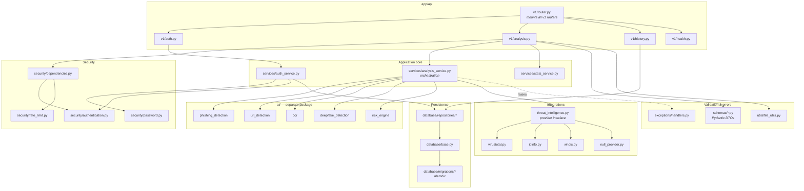
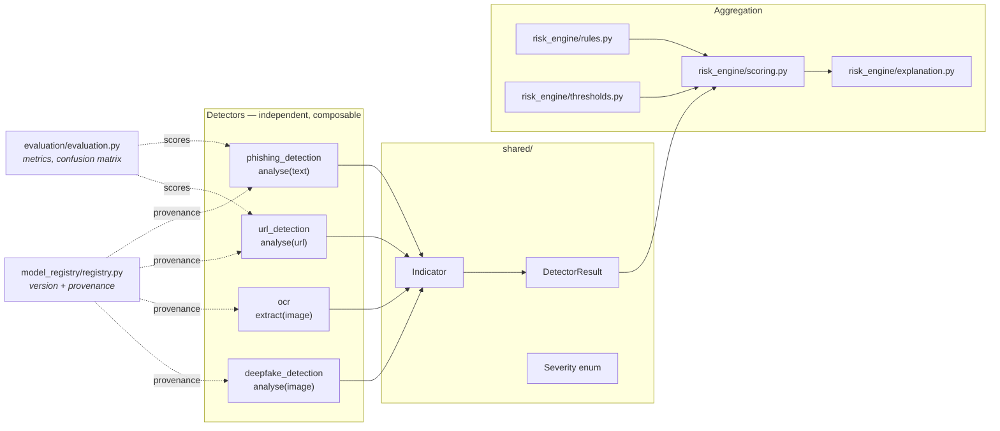
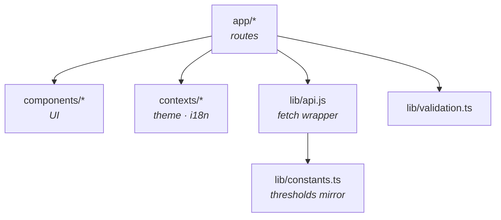

# Component Diagram

## Backend (FastAPI) — `backend/api/`

### Layer responsibilities

| Layer | May depend on | Must never |
|---|---|---|
| `api/v1/*` | schemas, services, security | import `ai/` directly, build SQL, touch the ORM |
| `services/*` | `ai/`, repositories, integrations | know about HTTP or Pydantic request objects |
| `ai/*` | nothing outside `ai/` | import the API, ORM, or perform I/O |
| `integrations/*` | `httpx` only | be imported by `ai/` (the engine receives results, not clients) |
| `database/repositories/*` | ORM, models | contain business rules |
| `models/*` | SQLAlchemy | be returned from a route — DTOs only |

### Endpoints by router

| Router | Path prefix | Routes |
|---|---|---|
| `auth` | `/auth` | register · login · refresh · me |
| `analysis` | `/analysis` | message · image · url · `{id}` |
| `history` | `/history`, `/stats` | list · summary |
| `health` | `/health` | live · ready |

## AI engine — `ai/`

- Each detector is a **pure function** with one public entry point.
- All detectors emit `Indicator` objects, so `risk_engine` can score any mix
  of sources without knowing which produced them.
- `model_registry` records which model or feature-set produced each signal —
  the basis for the honesty guarantees in §30.
- `evaluation/` measures detectors against labelled datasets. A detector with
  no evaluation report is treated as unvalidated.

## Frontend — `frontend/`

Existing Next.js 16 App Router application; retained.

`lib/constants.ts` currently mirrors the risk thresholds client-side. Once
`RISK_*` values are served from the API the frontend should read them from
the response instead of hard-coding, so there is a single source of truth.
Tracked as a follow-up.