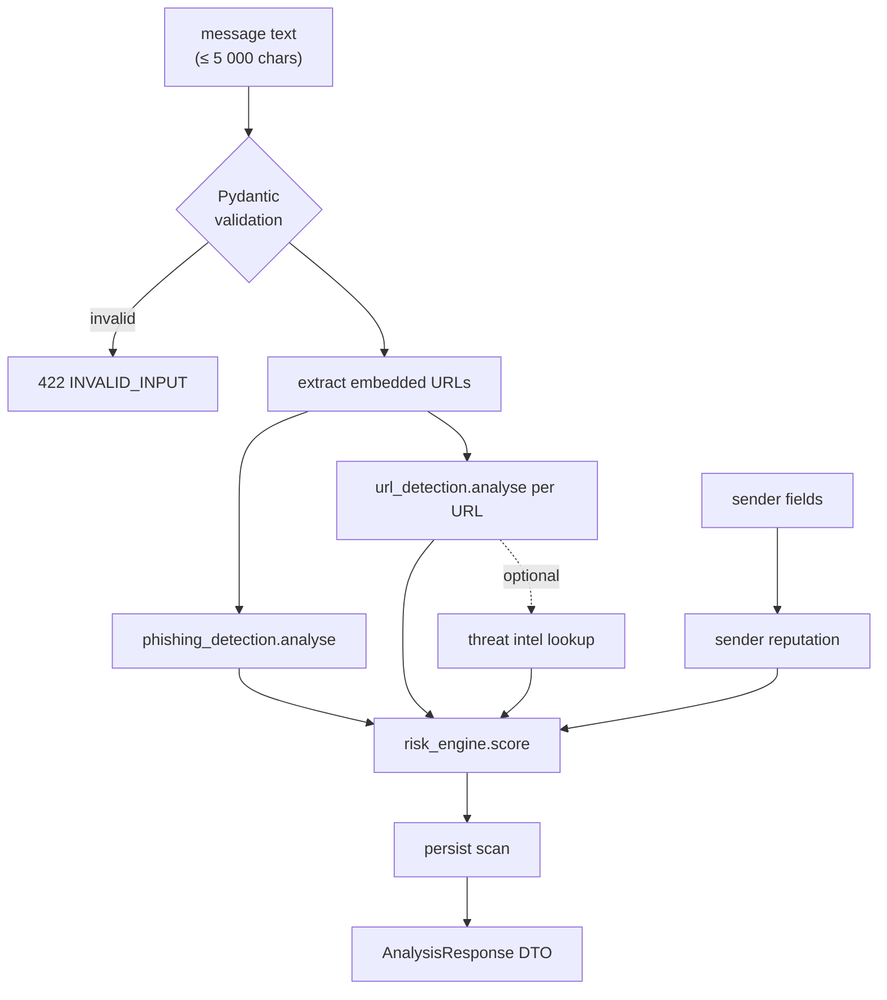
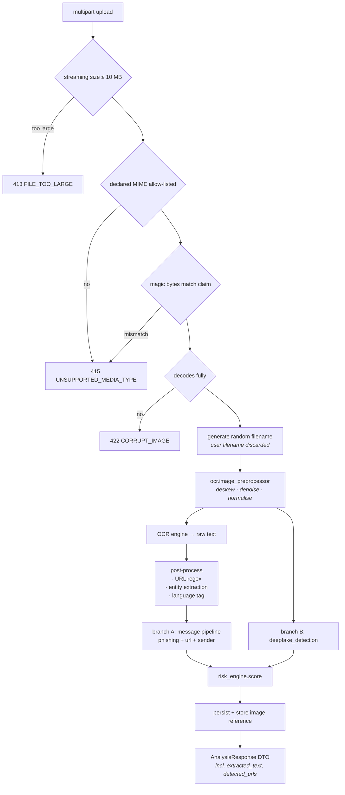
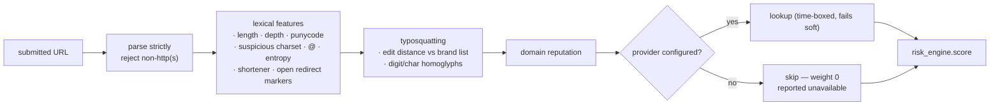

# Data Flow

How a piece of suspicious content becomes a verdict. Timings are indicative
offline targets on the reference laptop.

## 1. Message analysis — `POST /api/v1/analysis/message`



**Signal families produced:** `phishing`, `url`, `sender`, `threat_intel`.

Typical offline budget: ~15 ms. With threat intel enabled, bounded by
`THREAT_INTEL_TIMEOUT_SECONDS` per provider.

## 2. Image analysis — `POST /api/v1/analysis/image`



**Signal families produced:** `phishing`, `url`, `sender`, `threat_intel`, `image`.

Both branches run on the same bytes but are independent: OCR failure does not
prevent image forensics, and vice versa.

Preprocessing exists to serve OCR quality specifically — it is *not* model
input for the deepfake detector, which consumes the original decoded image so
that resampling artefacts are not mistaken for manipulation evidence.

## 3. URL analysis — `POST /api/v1/analysis/url`



**Critical:** the backend never issues an HTTP request to the submitted URL.
Analysis is lexical plus reputation-lookup. A submitted URL is only ever
transmitted to a configured reputation provider as a string. Private,
loopback and link-local hosts are rejected before feature extraction.

## 4. Result shape

One schema serves all three entry points, so the frontend renders results
uniformly.

```jsonc
{
  "analysis_id": "b7f3c1a2-...",
  "input_type": "image",              // message | image | url
  "classification": "phishing",       // phishing | suspicious | benign | ...
  "risk_score": 94,
  "risk_level": "DANGEROUS",          // SAFE | SUSPICIOUS | DANGEROUS
  "confidence": 0.93,
  "indicators": [
    {
      "type": "credential_request",
      "severity": "critical",
      "description": "The message asks the user to enter account credentials.",
      "evidence": "verify your account",
      "weight": 0.30,
      "simulated": false
    }
  ],
  "signals": {
    "phishing": { "available": true,  "score": 0.94 },
    "url":      { "available": true,  "score": 0.88 },
    "sender":   { "available": true,  "score": 0.60 },
    "threat_intel": { "available": false, "score": null, "reason": "no provider configured" },
    "image":    { "available": true,  "score": 0.71 }
  },
  "extracted_text": "URGENT: your account ...",
  "detected_urls": ["http://example-security-login.com"],
  "detected_entities": ["banking", "credential"],
  "explanation": "This message combines an unverified web address with a request for your banking credentials...",
  "recommended_actions": [
    "Do not click the link.",
    "Do not provide credentials.",
    "Verify the organisation through a channel you already trust."
  ],
  "model_versions": { "phishing": "rules-0.1.0", "url": "lexical-0.1.0" },
  "created_at": "2026-10-02T12:00:00Z",
  "duration_ms": 128
}
```

Two fields carry the honesty guarantees:

- **`signals[*].available: false`** with a `reason` — makes a skipped check
  visible instead of silently counting as clean.
- **`indicators[*].simulated`** — marks any signal not backed by a real model
  or live reputation data, so the UI can label it (§30).

## 5. Demo mode (§30)

`DEMO_MODE=true` serves a fixed set of precomputed scenarios so a live
presentation never depends on a third-party API.

| Scenario | Expected |
|---|---|
| Safe message | ~5–15 · SAFE |
| Phishing message | ~85–95 · DANGEROUS |
| Suspicious URL | ~70–90 · DANGEROUS |
| Fake banking screenshot | ~85–95 · DANGEROUS |

Fixture: [`database/seeds/development.sql`](../../database/seeds/development.sql).
Demo responses are marked `"simulated": true` on every indicator and shown
with a visible banner — simulated results are never presented as real model
output.