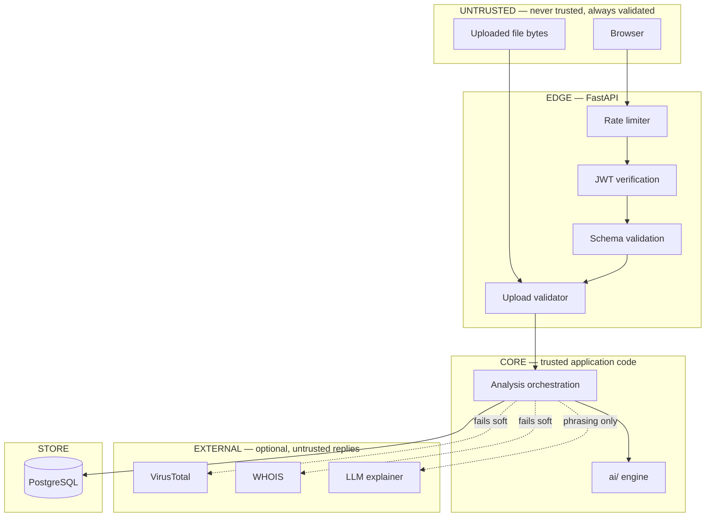

# Security Architecture

Negarit AI is a defensive product. It analyses suspicious content to help
users avoid it. There is deliberately **no** capability here to harvest
credentials, access systems without authorisation, deliver payloads, or
evade detection.

## 1. Trust boundaries



Everything above the `EDGE` line is attacker-controlled. No byte from a
browser reaches the engine or the database without passing it.

## 2. Controls

### Authentication (§21)

| Control | Implementation |
|---|---|
| Password storage | Argon2id via `pwdlib`, per-password salt |
| Tokens | JWT, `HS256`, short-lived access + long-lived refresh, server-side revocation list |
| Session storage (web) | Access token in memory, refresh token in `HttpOnly` `Secure` `SameSite=Strict` cookie |
| Default secret | **None.** The app refuses to start in staging/production without `JWT_SECRET`. |

The legacy Express backend shipped a hardcoded fallback secret
(`negarit-secret-key-change-in-production`), which made every token forgeable
if the env var was absent. That class of default is not carried forward.

### Authorisation

Object ownership is checked on every scan read. A scan belongs to exactly one
user; requests for another user's scan id return `404`, not `403`, so the
endpoint does not confirm that the id exists.

### Input validation (§21, §23)

- Every request body is a Pydantic model with explicit bounds. Unknown fields
  are rejected, not ignored.
- Message length and URL length are capped before any parsing.
- All database access goes through SQLAlchemy parameterised expressions or
  ORM queries. **No string-built SQL anywhere in the codebase.**

### Output encoding (XSS, §21)

Analysis results contain text extracted from attacker-controlled images. The
frontend renders every such string as React text content, which is escaped by
default. `dangerouslySetInnerHTML` is not used for any field that can carry
scanned content. The API additionally sets:

```
X-Content-Type-Options: nosniff
Content-Security-Policy: default-src 'self'; img-src 'self' data:; object-src 'none'; frame-ancestors 'none'
```

### File uploads (§22)

| Check | Rule |
|---|---|
| Size | Rejected at 10 MB, enforced while streaming, not after buffering |
| Declared MIME | Must be in the allow-list |
| Magic bytes | Verified — the real format must match the claimed type |
| Full decode | Image must decode completely; truncated files are rejected |
| Filename | **Ignored entirely.** A random server-side name is generated |
| Storage | Written outside any served directory, never executed |

Only the content hash and generated filename are persisted.

### Rate limiting (§21)

Two buckets: a general API bucket and a tighter bucket on the analysis
endpoints, which are the expensive ones. Keyed by authenticated user id where
available, otherwise by client IP. Backed by Redis in production, in-process
for single-node development.

### CORS

Explicit origin allow-list from configuration. Credentials enabled only for
listed origins. A wildcard origin is rejected at startup rather than silently
widened.

### Secrets (§21)

`.env` is git-ignored at both the repo root and per-service. `.env.example`
ships with every variable documented and **no real values**. `backend/.env`
contains a live third-party key and is excluded — verified with
`git check-ignore`.

### Logging (§24)

Logs are **allow-listed**, not deny-listed: only fields the request logger
declares are written. Message bodies, passwords, tokens and API keys are never
serialised. Every line carries a `request_id` so a user report can be traced
without retaining their content.

## 3. Threats considered

| Threat | Control |
|---|---|
| Credential stuffing | Argon2id cost factor, rate limiting, generic error text (no user-enumeration oracle) |
| Token forgery | No default secret; algorithm pinned to prevent `alg: none` |
| IDOR on scan history | Ownership filter on every read; `404` not `403` |
| Prompt injection via a scanned screenshot | Extraction runs as OCR, not as instructions. LLM input is wrapped as quoted data. The risk score never depends on LLM output |
| Malicious upload (decompression bomb / polyglot) | Streaming size cap, magic-byte check, full-decode verification, server-generated names |
| SSRF via URL analysis | URLs are analysed **lexically and via reputation APIs only** — the backend never fetches a submitted URL. Private/link-local ranges are rejected outright |
| Denial of service via analysis | Separate tighter rate-limit bucket; per-stage timeouts; no unbounded work per request |
| Error leakage | Uniform envelope; stack traces logged server-side, never serialised to the client |

The SSRF row is the most important structural decision in the URL path:
`url_detection` must **never** issue a request to the URL it is asked to
inspect. Reputation lookups send the URL to a third-party API as data. If an
active fetch is ever added, it must go through an egress proxy with a strict
allow-list.

## 4. Defensive-use boundary

The following are out of scope and will not be implemented: credential
harvesting, brute-forcing, vulnerability scanning of third-party systems,
exploit development, malware deployment, detection-evasion tooling, or
interacting with infrastructure the operator does not own. The platform reads
content **submitted by the user** and reports on it. It does not go and look.