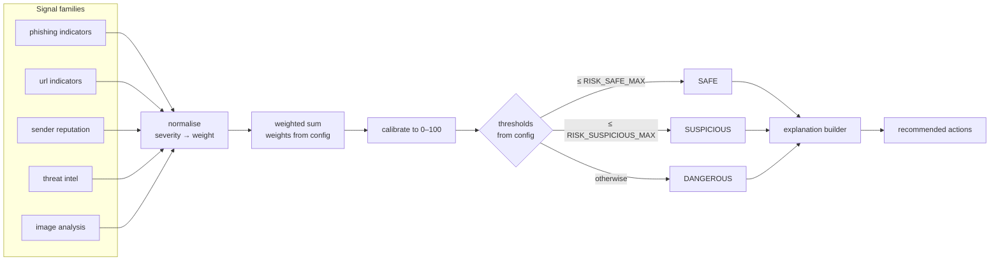

# System Architecture

> Status: describes the **target** architecture. The current state and the
> migration path are recorded in [Migration Status](#current-state).

## 1. Layering

The platform is five layers deep. Dependencies point **downward only**.

```
┌─────────────────────────────────────────────────────────────────┐
│ 1. CLIENT                                                          │
│    Next.js web  ·  (later: browser extension, mobile)             │
└───────────────────────────────┬─────────────────────────────────┘
                                │ HTTPS  JSON  JWT Bearer
┌───────────────────────────────▼─────────────────────────────────┐
│ 2. API  (FastAPI)                                                 │
│    routing · auth · validation · orchestration · error envelope   │
│    knows nothing about how detection works                       │
└───────────────────────────────┬─────────────────────────────────┘
                                │ in-process function calls
┌───────────────────────────────▼─────────────────────────────────┐
│ 3. AI ENGINE  (`ai/`)                                             │
│    phishing · url · ocr · deepfake │ risk_engine                 │
│    pure functions, no I/O, deterministic                         │
└───────────────┬──────────────────────────────┬──────────────────┘
                │                              │
┌───────────────▼──────────────┐  ┌────────────▼──────────────────┐
│ 4a. THREAT INTEL (optional)  │  │ 4b. EXPLAINER (optional)      │
│ VirusTotal · IPInfo · WHOIS  │  │ LLM used for phrasing ONLY    │
│ behind one provider interface │  │ never a detection signal     │
└──────────────────────────────┘  └───────────────────────────────┘
                                │
┌───────────────────────────────▼─────────────────────────────────┐
│ 5. PERSISTENCE                                                     │
│    PostgreSQL via SQLAlchemy 2.x + Alembic migrations            │
└─────────────────────────────────────────────────────────────────┘
```

## 2. Why the AI engine is a separate package

`ai/` depends on nothing in `backend/`. The API imports it; it never imports
the API. This is what makes the detection logic testable without a database,
a server, or a network, and it is what allows a future browser-extension or
mobile client to reuse the same engine.

## 3. Request flow — screenshot of a banking SMS

This is the reference scenario from the specification.

```mermaid
sequenceDiagram
    autonumber
    actor U as User
    participant FE as Web Client
    participant API as FastAPI
    participant SEC as Upload Validator
    participant OCR as ai/ocr
    participant PH as ai/phishing_detection
    participant URL as ai/url_detection
    participant TI as Threat Intel
    participant RE as ai/risk_engine
    participant DB as PostgreSQL

    U->>FE: Upload screenshot
    FE->>API: POST /api/v1/analysis/image (multipart)
    API->>SEC: validate MIME · size · decode integrity
    SEC-->>API: safe bytes + generated filename
    API->>OCR: extract(image)

    rect rgb(16, 32, 48)
        Note over OCR: deterministic, offline-capable
        OCR->>OCR: preprocess → OCR engine → text
    end
    OCR-->>API: text + detected_urls + entities

    par text signals
        API->>PH: analyse(text)
        PH-->>API: indicators + classification + confidence
    and url signals
        API->>URL: analyse(each detected URL)
        URL->>TI: lookup(url) [optional, fails soft]
        TI-->>URL: reputation or "unavailable"
        URL-->>API: indicators + features
    end

    API->>RE: combine(all signals)
    RE-->>API: score 0-100 · class · reasons · recommendation
    API->>DB: persist scan + indicators + score
    API-->>FE: structured result
    FE-->>U: 94/100 DANGEROUS + reasons + advice
```



### Failure behaviour

The pipeline is built so a single weak link degrades rather than fails:

| Failure | Behaviour |
|---|---|
| OCR engine missing | Text signals skipped, flagged as unavailable, image signals still scored |
| Threat-intel API down / no key | Timed out, skipped, weighted 0, labelled `unavailable` |
| DB write fails | Analysis still returned to the user; failure logged, not fatal |
| LLM unavailable | Template-based explanation used; **risk score unaffected** |

A scan can therefore never return "unable to analyse" because a third party
is unreachable.

## 4. The risk engine

The risk engine is the only component that emits a verdict.



Three properties are deliberate:

1. **Thresholds are configuration.** `RISK_SAFE_MAX` / `RISK_SUSPICIOUS_MAX`
   come from the environment. No threshold is a literal in logic.
2. **A signal family with no data contributes zero** and is reported as
   unavailable — it is never silently assumed safe.
3. **Missing evidence can raise suspicion but not certainty.** Absence of a
   threat-intel hit is not evidence of safety, so it never subtracts points.

## 5. Threat-intelligence abstraction (§8)

Providers are pluggable behind one interface so any can be swapped or removed
without touching the engine.

```python
class ThreatIntelligenceProvider(Protocol):
    name: str
    async def lookup_url(self, url: str) -> ProviderResult: ...
    async def lookup_domain(self, domain: str) -> ProviderResult: ...
```

Implementations: `VirusTotalProvider`, `IPInfoProvider`, `WhoisProvider`,
plus `NullProvider` used whenever keys are absent or `AI_OFFLINE_MODE` is set.

## 6. API surface (§14)

All routes are versioned under `/api/v1`. Database models are never returned
directly — every response is a Pydantic DTO.

| Method | Path | Purpose |
|---|---|---|
| POST | `/api/v1/auth/register` | Create account |
| POST | `/api/v1/auth/login` | Issue access + refresh token |
| POST | `/api/v1/auth/refresh` | Rotate tokens |
| GET | `/api/v1/auth/me` | Current principal |
| POST | `/api/v1/analysis/message` | Analyse message text |
| POST | `/api/v1/analysis/image` | Analyse screenshot |
| POST | `/api/v1/analysis/url` | Analyse a URL |
| GET | `/api/v1/analysis/{id}` | Fetch a stored result |
| GET | `/api/v1/history` | Paginated scan history |
| GET | `/api/v1/stats/summary` | Dashboard aggregates |
| GET | `/api/v1/health` | Liveness + dependency status |

## 7. Error envelope (§23)

One shape for every failure. Stack traces are never returned to clients.

```json
{
  "success": false,
  "error": {
    "code": "INVALID_INPUT",
    "message": "The submitted message is empty.",
    "request_id": "0f9c2a1e-..."
  }
}
```

## 8. Observability (§24)

Structured JSON logs carrying `request_id` throughout a request: endpoint,
status, response time, analysis id, and per-stage AI timings. Logged values
are allow-listed, so passwords, tokens and raw message bodies are never
written to logs.

## Current state

| Layer | State |
|---|---|
| Client (Next.js 16) | **Working.** 12 routes, auth, dashboard, i18n, theming. |
| API (Express) | **Working but to be replaced.** Single 734-line `app.js`, in-memory user store, flat `/api/*` routes. |
| AI engine (`ai/`) | **Skeleton only.** Every previous "analysis" was one LLM prompt. |
| Threat intel | **Absent.** |
| Persistence | **Absent.** `users = []` in memory. |
| Tests / Docker / CI | **Absent.** |

### Migration path

Existing frontend and backend are **left running and untouched** until the
FastAPI service reaches feature parity. Cutover happens per concern:

1. Ship `ai/` with tests — independently verifiable.
2. Ship FastAPI with auth + health, shadowing the legacy routes.
3. Add analysis endpoints; point the frontend at `/api/v1`.
4. Add PostgreSQL + Alembic and migrate the user store.
5. Delete the Express backend once parity is confirmed.

No step requires the product to be down at any point.

## Next

- [Component diagram](./component-diagram.md)
- [Data flow](./data-flow.md)
- [Security architecture](./security-architecture.md)
- [ERD](../database/erd.md)